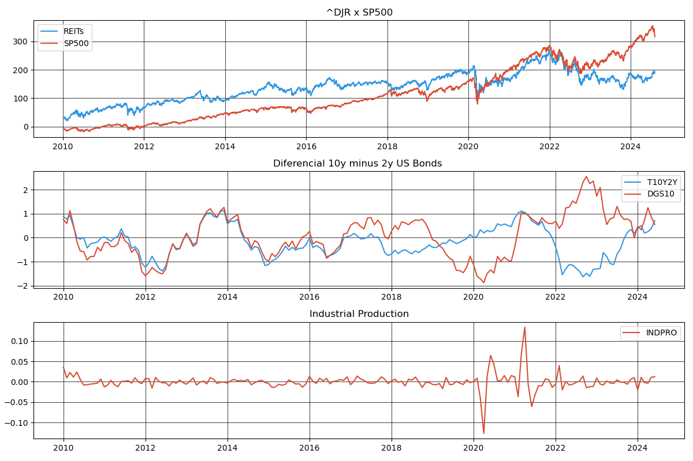

# Construção de Modelo VAR para estudo do efeito de variaveis macroeconomicas nos REITs.
Estudo criado com base artigo publicado na "Junior Management Science": \
" Exploring How Macroeconomic Factors Affect REITs and Evaluating Its Downside Risk – Empirical Evidence From China and the US " - Xiaoyu Hu - Technische Universität München (2022)

Escolhida como variável dependende  o índice DJR - Dow Jones Reits Index
Utilizando como variáveis explicativas:  \
1 - T10Y2Y: 10-Year Treasury Constant Maturity Minus 2-Year Treasury Constant Maturity \
2 - DGS10: 10-Year Treasury Constant Maturity Rate \
3 - INDPRO: Industrial Production Index \
4 - ^SPX: Principal índice de ações americano

